# Uso de Docker para el Mantenimiento Adaptativo

Docker se utiliza para el despliegue y mantenimiento adaptativo del proyecto de machine learning por las siguientes razones:

1. **Portabilidad**: Docker permite empacar la aplicación junto con todas sus dependencias en un contenedor, lo que garantiza que se pueda ejecutar de manera consistente en cualquier entorno.

2. **Aislamiento**: Los contenedores Docker proporcionan un entorno aislado para ejecutar la aplicación, lo que garantiza que las dependencias del proyecto no entren en conflicto con otras aplicaciones o servicios en el sistema.

3. **Escalabilidad**: Docker facilita la escalabilidad horizontal, lo que significa que puedes ejecutar múltiples contenedores de la misma aplicación para manejar cargas de trabajo más grandes de manera eficiente.

4. **Reproducibilidad**: Docker permite que todo el entorno de la aplicación, incluidas las versiones específicas de las bibliotecas y las configuraciones del sistema, se especifiquen y codifiquen en un archivo (`Dockerfile`), lo que garantiza la reproducibilidad del entorno en diferentes entornos de desarrollo, prueba y producción.

5. **Gestión de Versiones**: Docker facilita la gestión de versiones de la aplicación y sus dependencias, lo que permite un control más granular sobre los cambios y actualizaciones en el entorno de la aplicación.


<div style="text-align:center;">
  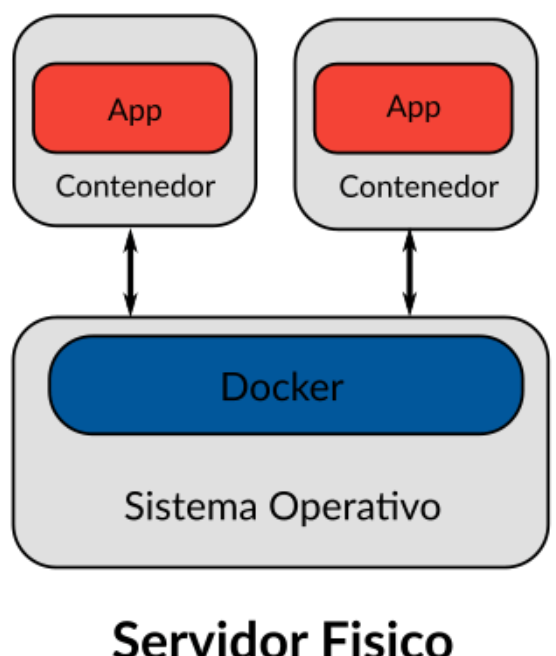
</div>


# Despliegue de Proyecto MLOps

En este documento, se describe cómo desplegar un proyecto de machine learning que expone una API a través de FastAPI en Python. Se utilizará Docker para el proceso de despliegue y mantenimiento adaptativo.

## Desplieque por render

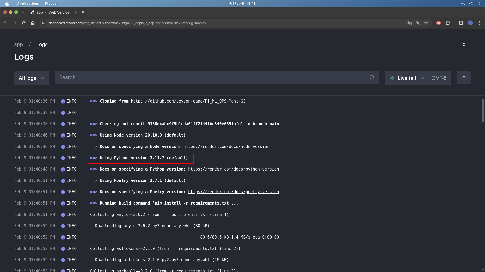

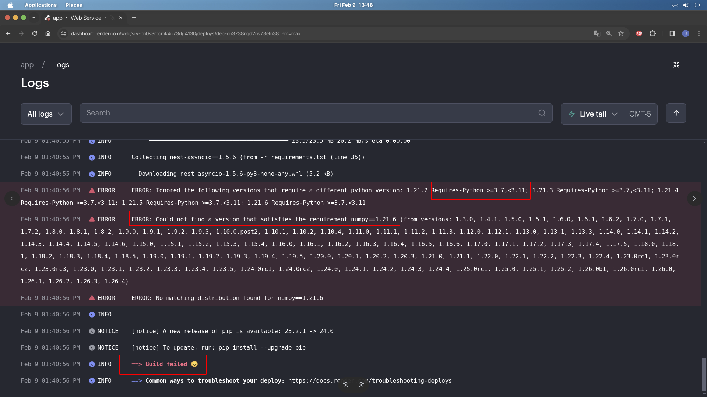


## Paso 1: Clonar el Repositorio

Clona el repositorio que contiene el código del proyecto desde GitHub:

```bash
git clone https://github.com/yeyson-cano/PI_ML_OPS-Mant-G3
cd PI_ML_OPS-Mant-G3
```

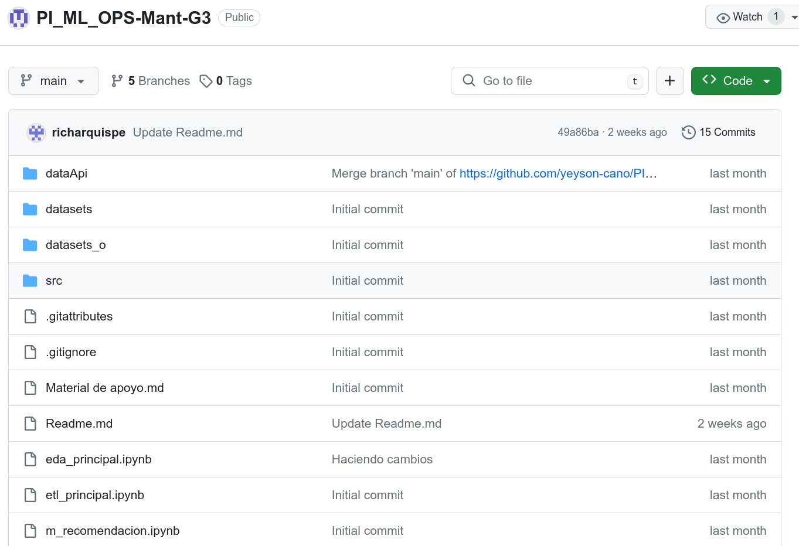

## Paso 2: Construir la Imagen de Docker

Construye la imagen de Docker para el proyecto. Esto creará un contenedor Docker que contendrá todas las dependencias y el código del proyecto:

```bash
docker build -t app:v1.0 .
```

## Paso 3: Ejecutar el Contenedor Docker

Una vez que se haya construido la imagen, ejecuta el contenedor Docker. Esto iniciará el servidor FastAPI y expondrá la API en el puerto 7860 del host:

```bash
docker run -d -p 7860:7860 app:v1.0
```

Ahora, la API del proyecto de machine learning estará accesible en `http://localhost:7860`.

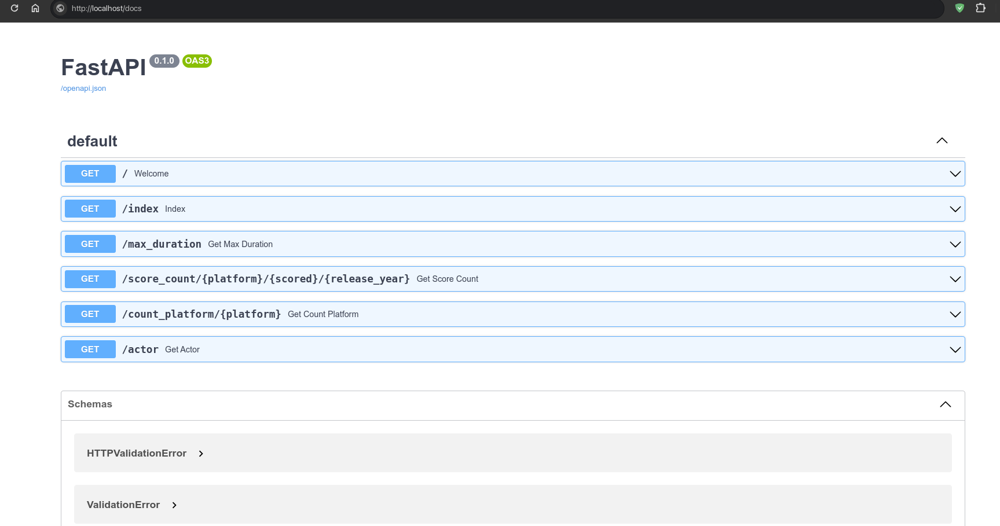


# Despliegue en HuggingFace

<div style="text-align:center;">
  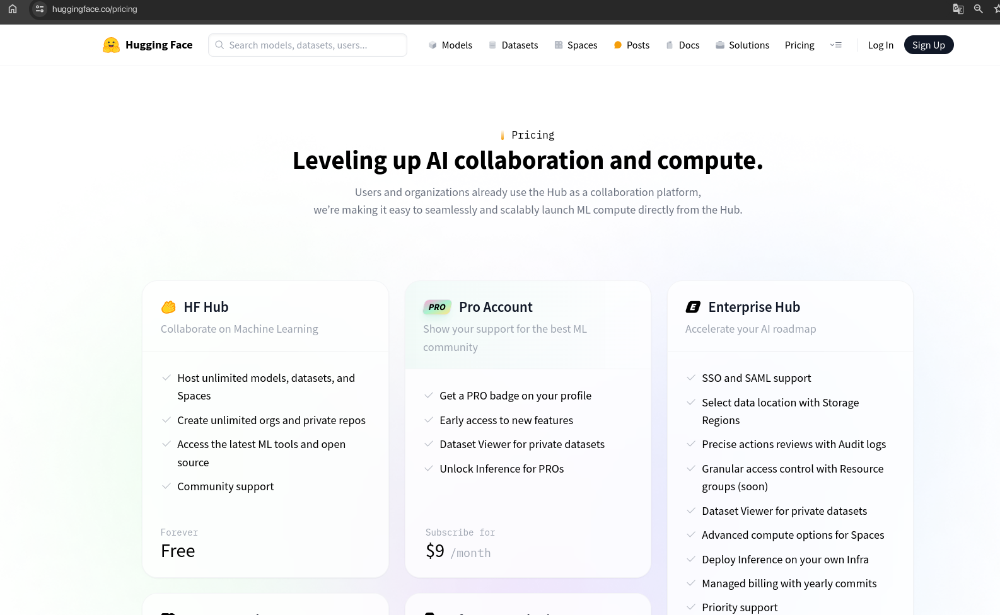
</div>

----

<div style="text-align:center;">
  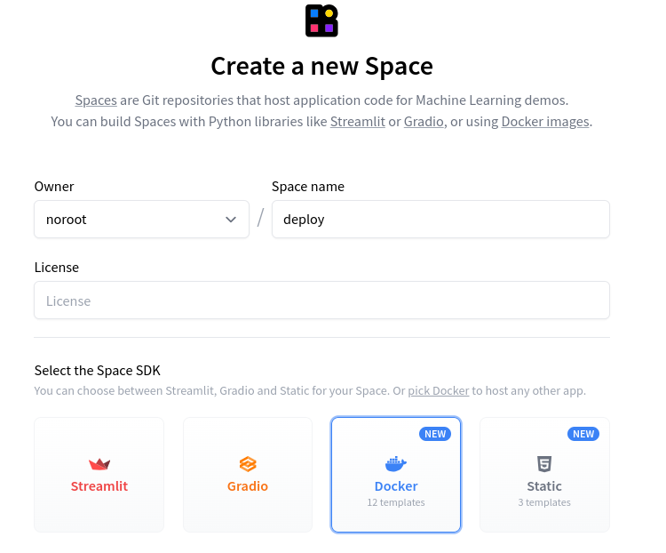
</div>


URL: [https://noroot-deploy.hf.space](https://noroot-deploy.hf.space)

<div style="text-align:center;">
  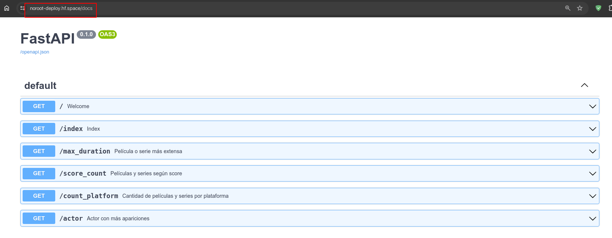
</div>

<div style="text-align:center;">
  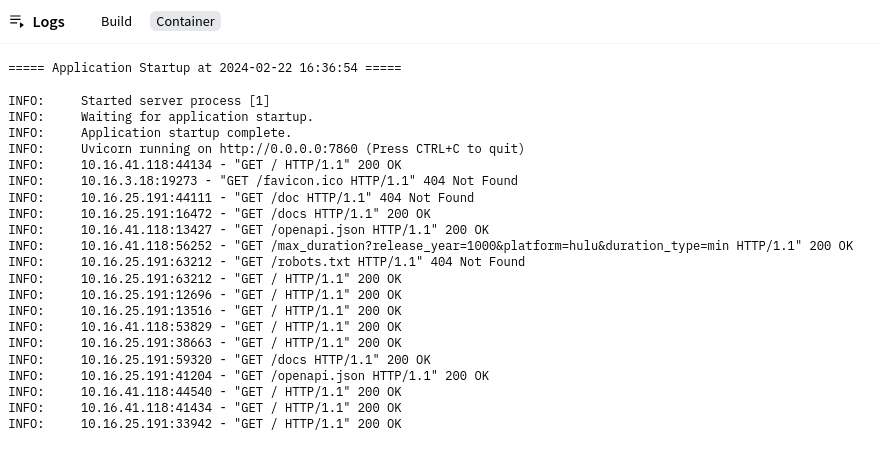
</div>


## Otas plataformas de despliegue

- Amazon Web Service
- Microsoft Azure
- Google Cloud Platform
- DigitalOcean
- Heroku
- Render
- StackPath
- Kamatera

-----
-----
-----

<div style="text-align:center;">
  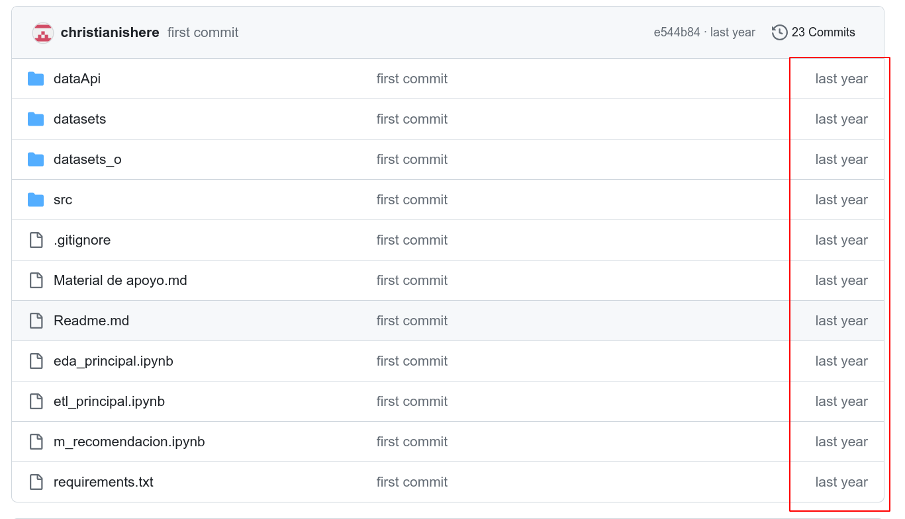
</div>

<div style="text-align:center;">
  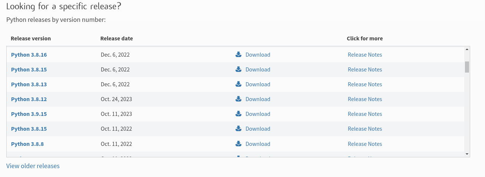
</div>


## Conclusión

El uso de Docker para el despliegue y mantenimiento adaptativo proporciona una forma eficiente y escalable de gestionar las aplicaciones en diferentes entornos. Al empacar la aplicación y todas sus dependencias en un contenedor, se garantiza la portabilidad, la consistencia y la reproducibilidad del entorno de la aplicación, lo que facilita su implementación y gestión en cualquier entorno de producción.
